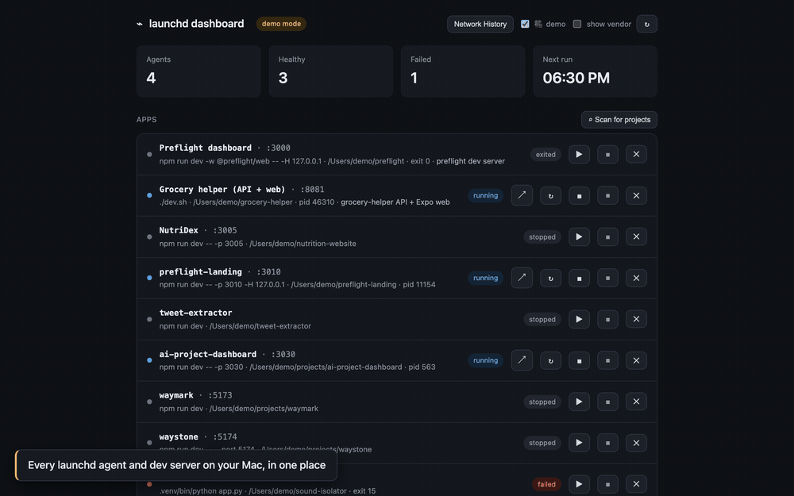

# Ground Control

**A self-hosted control tower for your Mac.**



Ground Control turns your Mac into a small server you can actually see. It lists every
scheduled job, shows whether it worked and when it runs next, starts your dev servers as
managed services, tells you which project owns each open port, and watches the network for
changes — a new listener, a port that opens to the network, an unknown device connecting,
or a job that failed quietly. It sends native macOS notifications and keeps a permanent
record: a run ledger per job, a sighting history per device, and an event archive that is
only ever added to. A demo mode hides private data so you can share what it sees.

Four questions it answers that nothing else on the machine will:

- *What is scheduled to run, and did last week's run actually happen?*
- *Which project owns `:3000`, and why is my dev server on `:3001`?*
- *Is anything I'm running reachable from outside this machine?*
- *Did that background job die three weeks ago without telling me?*

No magic: every fact comes straight from `launchctl`, plist files, and `lsof` (the tool
that lists open ports and files). Same machine, same answer, and nothing is guessed. It
runs **on** launchd, the macOS job scheduler: each app becomes a managed agent, and Ground
Control runs as one itself. The repo was formerly `launchd-dashboard`.

## Highlights
- **Five tabs in a sticky bar — Agents · Apps · Ports · Watch · History** — each with a live
  count. You can see that three agents failed or four ports are exposed without opening the
  tab. The tab is part of the URL (`/#ports`), so a reload or a bookmark lands where you
  left off.
- **Auto-discovery** of user LaunchAgents (`~/Library/LaunchAgents`, `/Library/LaunchAgents`).
  Vendor jobs (Apple/Google/etc.) are hidden by default.
- **Live status** per agent — running / idle / unloaded, PID, and **last exit code**
  (shown in red when a job failed quietly).
- **Human-readable schedule** ("Sun 10:00", "Daily 18:30", "Every 1h") plus a computed
  **next run** for calendar jobs.
- **Log tail** read straight from each job's `StandardOutPath`, and a **last-run** time
  taken from when the log file last changed (its mtime).
- **One-click control**: run-now (`kickstart`), stop (`kill`), enable/disable.
- **Port tracker**: every listening TCP port on the machine, with the process that holds it,
  **the project directory it belongs to** (its working directory, cwd, or dug out of the
  command line), and the launchd agent it runs under. It also has a "is port X free?"
  checker, an **exposed** flag for ports bound beyond loopback (so other machines can reach
  them), an **↗ open** button per port (`http://localhost:<port>` — by name, so it reaches
  the server whether it bound IPv4 or IPv6), and a two-tap SIGTERM to take a port back.
  Apple system listeners (AirPlay etc.) are hidden by default but still count as "taken".
  They get no open button — they aren't web pages. Ports that a configured app declares but
  isn't serving right now show as **claimed**, with a start button. So a project's port
  stays visible when its process isn't running.
- **App launcher**: declare your dev servers once in `apps.json` (dir, command, port) and
  start or stop them from the dashboard. No more hunting through terminals for
  `npm run dev`. Each launched app runs as a **transient launchd agent**
  (`com.launchddash.app.<slug>`) — one that exists only while it runs. So its status, last
  exit code, log tail, and port→app link all come from the same machinery as everything
  else. Stopping removes the agent completely. Apps in TCC-protected folders (the ones
  macOS privacy rules block) show as blocked with the reason, instead of failing with a
  cryptic error. Restart, an optional `"login": true` (the app comes back at next login)
  and a per-app `env` are supported. **✕ Remove** stops an app, deletes its plist and drops
  its config entry (freeing its claimed port). It never touches your project files. The
  Open button targets the port the app *actually* serves, and flags drift when that isn't
  the one it declared.
- **Scan for projects**: one click finds git repos it can launch across your project roots
  and writes their entries for you. It also repairs the path of a project you've **moved**.
- **Network watch**: the always-on agent compares the port scan every 30s and **alerts**
  you — with native macOS banners, the Watch tab and a `(N!)` badge in the page title — when
  a **new process starts listening**, a listener **flips from loopback to LAN-exposed**, or
  **another device actually connects** to one of your servers. It tells your own Wi-Fi
  devices apart from public internet addresses. One tap acknowledges an alert for good.
  "allow app" whitelists a command that binds a fresh random port every session (Chrome).
  The first scan records the starting point quietly — you're alerted about *changes*, not
  your existing setup. **Honest scope**: this polls `lsof` as your user. It is not an
  intrusion detection system (IDS). It cannot see port scans, connections shorter than the
  poll interval, or outbound traffic. For outbound control or packet-level detection, use a
  firewall like Little Snitch or LuLu.
- **Agent-failure alerts + notification history**: the same watcher also sends a banner
  when one of **your launchd agents fails** — a nonzero exit with nothing running. That is
  the kind of quiet failure that let a weekly job die unnoticed for eleven days. A stop or
  restart you start from the dashboard is never mistaken for a crash, and the alert clears
  on its own when the job recovers. The **History** tab holds
  the full event log *and* every banner the agent tried to send, each marked **sent** or
  **failed**. So a broken notification channel (or a missed banner) is itself visible, and
  not lost the moment it scrolls off your screen. **Click any event** (in History or the
  Watch tail) to open a detail card. For a new listener: the full command line, plus whether
  it's *still* listening right now. For a connection: the remote endpoint and the device
  name it resolved to. For an agent: its exit code, schedule, and a one-click jump to its
  log.
- **It keeps what it sees.** Comparing scans alone throws away everything that *isn't* a
  change. So the watcher also records: **sighting stats** per listener and device (first
  seen, last seen, and how many separate times — so a card says "last seen listening 2h
  ago" or "connected 14×", not just "gone"); a **run ledger** per launchd agent (every run
  it detects, with the exit code, which answers "has this job actually run every
  Sunday?"); a **devices roster** in the History tab that lists every machine that ever
  connected to your services, with the ports it touched; and an **append-only
  `netwatch.log.jsonl`** archive. The archive exists because the in-memory rings hold a
  fixed number of events, and a busy week would otherwise erase an earlier one. It is never
  trimmed — `grep`/`jq` it.
- **🎥 Demo mode** — one toggle in the header hides the private data on screen, so you can
  record a public GIF or screenshot. IP addresses become documentation addresses
  (`192.0.2.x`, the range reserved for exactly this), device names become `device-1.local`,
  and your home path becomes `/Users/demo`. Ports, project names and agent labels stay —
  they're the part worth showing. The masking is consistent for the whole session (one real
  address always maps to the same fake one), display-only (the API keeps serving the truth,
  and nothing on disk changes), and never saved. **It masks those categories, not arbitrary
  secrets.** It can't know that a token in a command line or a log line is sensitive, so
  review the footage before you publish it.
- **Self-hostable**: ships a launchd plist template, so the dashboard runs as *its own*
  agent and shows up in its own list.

## Quickstart

> **Clone it somewhere launchd can read.** macOS privacy protection (TCC) blocks
> background agents from `~/Documents`, `~/Desktop`, and `~/Downloads`. A launchd agent
> there dies with `PermissionError: [Errno 1] Operation not permitted` before your code
> even runs. Your terminal works only because Terminal.app holds the folder grant. Clone
> to a path at the top of your home folder, like `~/ground-control`, instead.

```bash
cd ~/ground-control
./run.sh                       # creates .venv on first run, serves on :8787
# open http://127.0.0.1:8787
```

Tests:
```bash
python3 -m venv .venv && ./.venv/bin/pip install -r requirements-dev.txt
./.venv/bin/python -m pytest -q
```

## Run it as an always-on agent
```bash
./run.sh                       # once, to create the .venv
sed "s|/Users/CHANGE_ME/ground-control|$PWD|g" com.launchddash.server.plist.example \
  > ~/Library/LaunchAgents/com.launchddash.server.plist
launchctl bootstrap gui/$(id -u) ~/Library/LaunchAgents/com.launchddash.server.plist
```
Now `http://127.0.0.1:8787` is always up, and the dashboard lists itself.

Stop the `./run.sh` instance first if it's running. The agent can't bind :8787 while
something else holds it, and the dashboard's own Listening-ports section will show you who
holds it. The `sed` above fills in wherever you cloned, so the template works from any
path. Just keep it out of the TCC-protected folders (see Quickstart). The agent label stays
`com.launchddash.server`. A label is an identity that running jobs and installed plists
refer to, so renaming it would only cause churn.

## API
| Method | Path | Purpose |
| ------ | ---- | ------- |
| GET | `/api/agents?all=false` | list agents (set `all=true` to include vendor jobs) |
| GET | `/api/agents/{label}/log?lines=200` | tail an agent's stdout/stderr log |
| POST | `/api/agents/{label}/run` | run now (`launchctl kickstart -k`) |
| POST | `/api/agents/{label}/stop` | stop (`launchctl kill TERM`) |
| POST | `/api/agents/{label}/{enable,disable}` | toggle |
| GET | `/api/ports?all=false` | listening TCP ports with process/project/agent attribution (`all=true` includes system listeners) |
| POST | `/api/ports/{pid}/kill` | SIGTERM a listener (refused unless the pid currently holds a listening port) |
| GET | `/api/apps` | configured apps with live status (running/stopped/exited/failed/blocked) |
| POST | `/api/apps/{slug}/{start,stop,restart}` | launch / stop / restart as a transient launchd agent (slugs only — commands never cross HTTP) |
| DELETE | `/api/apps/{slug}` | un-manage an app: stop it, delete its plist, drop its `apps.json` entry (project files untouched) |
| GET | `/api/apps/{slug}/log?lines=200` | tail a launched app's log |
| GET | `/api/apps/discover` | scan the roots for launchable git projects (server-side inference) |
| POST | `/api/apps/adopt` | add scanned candidates to apps.json by slug (append-only; never rewrites your edits) |
| GET | `/api/watch` | network-watch state: active alerts, recent events, watcher health, failed-send count, sighting stats + run ledger |
| GET | `/api/watch/history` | full event ring + every banner the watcher sent (✓ sent / ✗ failed) + sightings, run ledger, archive size |
| POST | `/api/watch/ack` | acknowledge an alert (`{"key": …}`) or always-allow a command (`{"command": …}`) — only server-minted active alerts are accepted |

## Launch your dev apps

The fast path: click **Scan for projects** in the Apps section. The server walks the project
roots that exist on your machine — the home root, `~/projects`, `~/Projects`, `~/dev`,
`~/code`, `~/src`, `~/repos`, `~/workspace`, `~/Documents` (one level each; add more in
`CANDIDATE_ROOTS`) — and looks for git repos. For each one it works out how to start it:
`dev.sh`/`run.sh`, an npm `dev`/`start` script, a workspace's dev script
(`npm run dev -w web`), or a Python entry point (`app.py`/`main.py`/`server.py`) run by the
project's own `.venv` (or by `uv run` when there's a `pyproject.toml` but no venv). The port
is read from the script text or the framework's default. A repo it cannot work out is
listed as **no launch found** with the reason, not skipped quietly. Tick the ones you want,
click Add, done. Projects that are already configured show as such. Projects in
TCC-protected folders appear as *blocked* with a hint to move them. Candidates are built
entirely on the server. The browser only posts back which slugs to adopt, so commands never
cross HTTP. The guesses are heuristic: hand-tune the written `apps.json` afterwards if a
project needs env vars or a different port. Your edits are never overwritten — adoption
only appends.

Or do it by hand: copy `apps.json.example` to `apps.json` (it is gitignored, because it
holds paths specific to your machine) and list your projects:

```json
[
  { "slug": "web", "name": "My web app", "dir": "~/my-web-app",
    "command": "npm run dev", "port": 3000 }
]
```

Start writes a `com.launchddash.app.<slug>` plist (with `RunAtLoad` and deliberately **no
`KeepAlive`** — a crashed dev server should show as failed, not restart in a loop), logs to
`~/Library/Logs/launchddash/<slug>.log`, and bootstraps it (loads it into launchd). Stop
boots it out **and deletes the plist**, so nothing lingers in your login items. Generated
plists include a `PATH` that works under launchd (homebrew, `~/.local/bin`, the newest fnm
node), because agents don't get your shell profile. The TCC rule from Quickstart applies to
every app too: projects must live outside `~/Documents`/`~/Desktop`/`~/Downloads`, and the
dashboard marks any that don't as blocked.

## Security
The control endpoints change real jobs, so the server **binds to `127.0.0.1` only**. It is
not meant to be reachable beyond your machine. Managing system `LaunchDaemons` (which need
root) is out of scope for now, on purpose. This manages your **user** agents, and needs no
`sudo`.

Binding to loopback is not enough on its own. The browser is on loopback too, so any page
you visit could POST to these routes and only be denied the *response*. So the server
refuses any request that changes state unless the browser says it came from this page
(`Sec-Fetch-Site`, with an `Origin`-vs-`Host` fallback). A foreign `Host` header is
rejected outright. That closes the DNS-rebinding path, which would otherwise let a remote
page read your data. Everything the machine puts on the page — plist labels, process
names, directory names, a scanned repo's `package.json` name — is HTML-escaped, and no
value is ever written into an inline event handler.

Nothing personal is committed. `pytest tests/test_privacy.py` fails on a real home path, a
`.local` device name, or a private address outside a small fixture allowlist.
`./scripts/privacy-check.sh` greps every tracked file for values read from *this* machine
at run time — the half CI cannot do, since knowing those values would mean committing them.

## How it works
- **Discovery / schedule**: Python's `plistlib` parses each `*.plist`. `StartCalendarInterval`
  / `StartInterval` / `RunAtLoad` are turned into a label plus a next-run time, to the minute.
- **State**: `launchctl list <label>` → PID + `LastExitStatus`. The running/idle/unloaded
  split follows what `launchctl print` means by each.
- **Control**: modern `launchctl` subcommands in the `gui/<uid>` domain
  (`kickstart` / `kill` / `enable` / `disable`).
- **Ports**: `lsof -iTCP -sTCP:LISTEN` in `-F` field mode, which is built for machines to
  parse (no guessing at columns). Each pid is then enriched with `lsof -d cwd` (working
  directory → project) and `ps` (full command line + parent pid). To link a port to an
  agent it **walks the ppid chain** (each process's parent, and its parent) up into the
  agents' pids, because the listener is usually a child of the agent's process
  (`run.sh` → `uvicorn`). No `sudo`: user processes only — which is exactly the set of dev
  servers.

The pure parsers (`humanize_schedule`, `next_run`, `parse_launchctl_list`, and everything
in `app/ports.py`) are unit-tested against fixtures, so the logic is checked without a
live machine.

## Experience Gained
- Designed and built a **self-hosted observability and control plane** for a developer
  machine: a FastAPI service with **21 HTTP routes** plus a **zero-dependency, 54 KB
  web UI** (five tabs, no framework, no build step), on **two runtime dependencies**. It lists
  scheduled jobs, launches dev servers as managed services, links every listening port to
  its owner and watches the network, and hosts itself as its own `launchd` agent.
- Worked directly with **`launchd` internals** (plist parsing, `launchctl` state
  inspection, job control in the per-user GUI domain) behind a **deterministic,
  fixture-tested core**: **299 tests at 88% coverage against a ratcheted CI floor** (a
  floor that can only go up), with zero live system calls, so a macOS-only tool's suite runs
  green on Linux CI in under a minute. Every guard is proven to fail first by an automated
  sabotage harness (**23 mutations, each restored from a byte copy and verified
  byte-identical**).
- Built a **network-port observability layer** under **15 parser tests**: `lsof`/`ps`
  field-mode parsing, process → project attribution from the working directory and the
  command line, parent-pid chain walking to link sockets to the service that manages them,
  loopback-vs-LAN bind checks, and process control that re-checks the process still holds a
  listening port before signalling, so the endpoint cannot be aimed at an arbitrary pid.
- Extended it into a **config-driven service launcher** (**56 tests**): launchd plists
  generated on the fly with a self-contained `PATH` for daemon contexts, full lifecycle
  management (start/stop/restart, start-at-login, per-app environment), project discovery
  across **9 scan roots** resolving to **6 adoption states**, and a slug-only HTTP surface so
  a command never crosses the wire — the browser posts back only which slugs to adopt.
- Shipped a **background monitoring loop with native alerting and an auditable delivery
  log**: a 30-second watcher over **6 alert kinds**. It diffs listener and connection scans
  against a saved baseline, classifies remote addresses (loopback / private / public,
  failing closed on input it cannot parse), fires job-failure alerts once on the change
  while exempting stops the operator started, and records every notification as delivered
  or failed, so the alerting channel is itself observable. Its long-term state — capped
  event and notification rings, a per-agent run ledger and an append-only JSONL archive —
  is what made a destroyed state file recoverable in full.
- **Eliminated a 100% false-positive alert class** by diagnosing an ephemeral-port
  collision — macOS draws outbound local ports from the same 49152–65535 range that local
  services listen on — and replacing a match on port number with a check that the
  listener's address is actually reachable. The false alert became structurally impossible,
  rather than filtered out by a rule of thumb.
- **Closed a CSRF and an XSS-to-RCE path in a localhost-only tool**, proving each was real
  by watching the old build fail. A cross-origin form could SIGTERM any listening process
  (**11 mutating routes**, now covered by tests generated from the app's own route table, so
  a new route inherits them). A cloned repo whose `package.json` name was an injection
  payload ran code on the dashboard's origin. Paired with a two-part privacy gate that keeps
  a public repo free of machine-derived data, and a CI matrix that runs the **lowest Python
  the project supports**, not just the newest.
